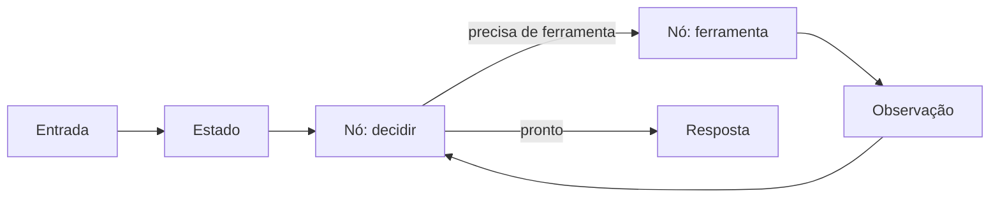

# LangChain e LangGraph na prática

Um guia autoral para entender e experimentar aplicações agênticas com Python, LangChain e LangGraph.

Este repositório nasceu durante o estudo do curso [IA agêntica com LangChain e LangGraph](https://www.coursera.org/learn/agentic-ai-with-langchain-and-langgraph), da IBM na Coursera. A proposta é transformar a experiência de laboratório em um caminho útil para outras pessoas: começar pelo modelo mental, observar o fluxo e só depois conectar serviços reais.

> O curso é a referência de estudo. Os textos, exemplos e conclusões aqui são autorais. Os notebooks, vídeos, leituras e respostas de avaliação do curso não são redistribuídos.

## O que você vai aprender

Ao seguir este guia, você vai entender primeiro a ideia e depois a arquitetura:

- o que LangChain e LangGraph resolvem;
- como estado, nós e decisões formam um fluxo;
- como Reflection, Reflexion e ReAct funcionam;
- quais trade-offs aparecem quando o protótipo vira sistema;
- como experimentar sem colocar credenciais ou dados reais no notebook.

O percurso vai do modelo mental à decisão de arquitetura. Cada etapa responde três perguntas: qual problema estamos resolvendo, como o fluxo toma decisões e como verificamos que ele terminou corretamente.

## A explicação simples

Imagine uma cozinha que prepara pedidos.

**LangChain é a caixa de ferramentas da cozinha.** Ela reúne ingredientes e utensílios para conversar com o modelo, montar prompts, chamar ferramentas e organizar respostas. Você consegue preparar um pedido seguindo uma receita linear.

**LangGraph é o mapa de operação da cozinha.** Ele diz qual estação trabalha agora, que informação passa para a próxima, o que acontece quando falta um ingrediente e quando o pedido está pronto. Se houver revisão, repetição ou caminhos diferentes, o mapa deixa isso visível.

Outra analogia: LangChain fornece os músicos e instrumentos; LangGraph é a partitura e o maestro que coordenam entradas, pausas e repetições.

A frase para guardar é:

> **LangChain conecta as peças; LangGraph coordena o fluxo quando existe estado, decisão ou repetição.**

## Links oficiais para continuar

- [LangChain — visão geral](https://docs.langchain.com/oss/python/langchain/overview): framework, agentes e integrações.
- [LangChain — agentes](https://docs.langchain.com/oss/python/langchain/agents): ferramentas, loop de execução e condições de parada.
- [LangGraph — visão geral](https://docs.langchain.com/oss/python/langgraph/overview): runtime para workflows e agentes com estado.
- [LangGraph — Graph API](https://docs.langchain.com/oss/python/langgraph/use-graph-api): estado, nós, arestas, sequências, ramificações e loops.
- [Thinking in LangGraph](https://docs.langchain.com/oss/python/langgraph/thinking-in-langgraph): como decompor um processo antes de escrever o grafo.
- [Workflows e agentes](https://docs.langchain.com/oss/python/langgraph/workflows-agents): quando usar caminhos determinísticos ou decisões do agente.
- [LangSmith](https://docs.langchain.com/langsmith/home): rastreamento, depuração e avaliação de aplicações LLM.

Os links apontam para a documentação oficial atual da equipe LangChain.

Uma cadeia simples pode ser suficiente para receber uma pergunta, montar um prompt e gerar uma resposta. Um grafo ajuda quando o sistema precisa consultar uma ferramenta, avaliar o resultado, escolher outro caminho ou repetir uma etapa até uma condição de parada.



## Comece pelo exemplo executável

O exemplo usa apenas a biblioteca padrão do Python. Ele simula os padrões estudados com dados fictícios, sem API key e sem custo:

```bash
python3 examples/padroes_autorais.py
```

O arquivo mostra três ideias pequenas:

1. **Estado:** etapas diferentes atualizam o mesmo objeto.
2. **Reflexão:** uma resposta é revisada com uma regra objetiva de tamanho.
3. **ReAct:** o agente decide se precisa de uma ferramenta local simulada, observa o resultado e encerra.

Depois de entender esse fluxo, você pode substituir cada função por componentes reais de LangChain e LangGraph, seguindo a documentação oficial.

### Pré-requisitos

- Python 3.10 ou superior;
- terminal e Git;
- curiosidade para testar primeiro com dados fictícios.

O exemplo não exige conta, chave de API ou serviço externo. Para conectar um modelo real, configure os segredos no ambiente local e nunca os salve neste repositório.

## Mapa do repositório

| Caminho | Para que serve |
|---|---|
| [`docs/auditoria-do-curso.md`](docs/auditoria-do-curso.md) | Estrutura atual dos módulos, lições e avaliações observadas na Coursera. |
| [`docs/langchain-e-langgraph.md`](docs/langchain-e-langgraph.md) | Diferença entre as bibliotecas e um esqueleto de fluxo com estado. |
| [`docs/labs.md`](docs/labs.md) | Relato do que foi feito nos laboratórios e dos aprendizados. |
| [`docs/trajetoria.md`](docs/trajetoria.md) | Decisões, erros, correções e evolução do estudo. |
| [`docs/modelos-mentais.md`](docs/modelos-mentais.md) | Estado, nós, roteamento, reflexão e ReAct em linguagem direta. |
| [`docs/folha-de-dicas-multiagentes.md`](docs/folha-de-dicas-multiagentes.md) | Revisão autoral da folha de dicas do Módulo 3. |
| [`docs/estudo-responsavel.md`](docs/estudo-responsavel.md) | Regras para experimentar e publicar sem expor segredos ou material proprietário. |
| [`docs/decisoes-staff.md`](docs/decisoes-staff.md) | Trade-offs de arquitetura e critérios de prontidão operacional. |
| [`labs/`](labs/) | Versões autorais resumidas dos exercícios práticos realizados, incluindo o DocChat. |
| [`examples/`](examples/) | Código mínimo executável para visualizar os padrões. |

## O que muda quando pensamos como Staff

A discussão completa está em [Decisões e trade-offs em nível Staff](docs/decisoes-staff.md).

Um protótipo que “responde bem” é só o começo. Antes de colocar um agente em um produto, vale responder perguntas de arquitetura:

| Decisão | Pergunta de revisão | Evidência esperada |
|---|---|---|
| Escopo | O que o agente pode decidir e o que continua determinístico? | Diagrama com fronteiras claras. |
| Estado | Qual é o mínimo de estado necessário para retomar uma execução? | Schema versionado e exemplos de transição. |
| Ferramentas | Quais ações têm efeito externo e quais são somente leitura? | Contrato de entrada, saída, timeout e erro. |
| Parada | Quando o fluxo termina, repete ou pede intervenção humana? | Condição de parada testada e limite de iterações. |
| Observabilidade | Como investigar uma resposta ruim ou uma chamada cara? | Trace por execução, métricas e correlação. |
| Segurança | Que dados podem entrar no prompt e quais segredos ficam fora dele? | Allowlist, redaction e gestão de segredos. |
| Custo e latência | Qual é o orçamento por execução e o pior caso? | Cenários medidos, timeout e fallback. |

A escolha entre LangChain e LangGraph deve sair dessas restrições. Um fluxo simples pode começar com abstrações de alto nível; um processo com ciclos, aprovação humana, persistência ou múltiplos agentes precisa tornar o controle explícito.

## O que fizemos nos laboratórios

A sequência prática foi:

1. **LangGraph 101:** fluxo com estado, validação, contexto, resposta e encerramento.
2. **Reflection:** geração, crítica e decisão entre melhorar ou terminar.
3. **Reflexion com conhecimento externo:** consulta, evidência e revisão condicionada.
4. **ReAct:** pensamento, ação, entrada da ação, observação e resposta final.
5. **DocChat:** preparação de documentos, RAG multiagente, busca híbrida e verificação de evidências.

Um detalhe importante apareceu durante a prática: o modelo afirmou que uma resposta respeitava um limite de caracteres quando a contagem real mostrava o contrário. A conclusão vale para qualquer agente: reflexão pode ajudar a melhorar uma saída, mas não substitui um verificador determinístico.

No laboratório ReAct, a busca externa retornou `401 Unauthorized` porque o ambiente ainda tinha um marcador de chave. Nenhuma chave pessoal foi inserida. O erro ficou registrado como aprendizado de segurança e integração.

No DocChat, a analogia mais útil foi a de uma equipe de pesquisa: um agente localiza evidências, outro raciocina e outro verifica contradições. A busca lexical encontra termos exatos; a busca vetorial encontra significado. O LangGraph coordena esse trabalho, enquanto LangChain conecta os componentes de RAG e o Gradio apresenta a interface. O resumo completo está em [`labs/05-docchat.md`](labs/05-docchat.md).

## Um roteiro de revisão

Ao terminar cada prática, responda em suas próprias palavras:

1. Qual é o estado mínimo que o fluxo precisa carregar?
2. Qual nó toma cada decisão e qual evidência ele produz?
3. O que acontece quando uma ferramenta falha ou não há contexto?
4. Qual regra pode ser validada por código, sem depender da opinião do modelo?
5. Onde uma pessoa precisa revisar ou autorizar a próxima ação?

Se você não consegue responder essas perguntas, o próximo passo é observar o fluxo e registrar um exemplo de entrada, transição e saída antes de adicionar mais agentes.

## Trilha recomendada

Se você está começando, siga esta ordem:

1. leia [LangChain e LangGraph](docs/langchain-e-langgraph.md);
2. execute o exemplo autoral;
3. leia [01 — Fluxo com estado](labs/01-fluxo-com-estado.md);
4. compare Reflection, Reflexion e ReAct nos outros arquivos de [`labs/`](labs/);
5. só então conecte um modelo ou uma ferramenta em um ambiente seguro;
6. registre entradas, saídas, erros e condições de parada.

## Relação com o curso

O curso da IBM na Coursera apresenta conceitos, leituras, vídeos, práticas e laboratórios que serviram como base para este estudo. Este repositório ajuda a organizar o aprendizado e oferece referências independentes; ele não substitui a plataforma, as instruções oficiais nem as avaliações.

Para ver a estrutura que foi conferida na conta, consulte a [auditoria do curso](docs/auditoria-do-curso.md).

## Status do estudo

Os Módulos 1 e 2 aparecem concluídos na plataforma. O Módulo 3 está incompleto e será documentado conforme for estudado.

## Como contribuir

Encontrou uma explicação confusa, um exemplo que pode ser mais simples ou uma fonte oficial útil? Abra uma issue descrevendo o ponto e, se possível, proponha uma alteração pequena. A ideia é manter o guia verificável, acessível e útil para quem está praticando.

## Licença

Código e textos autorais deste repositório: MIT. A licença não se aplica ao conteúdo proprietário do curso, que permanece no ambiente da Coursera/IBM.
